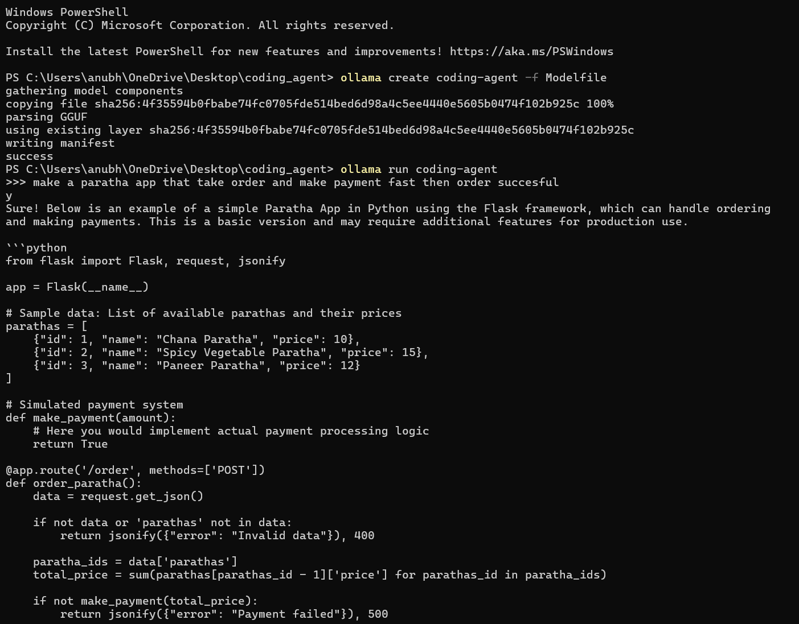
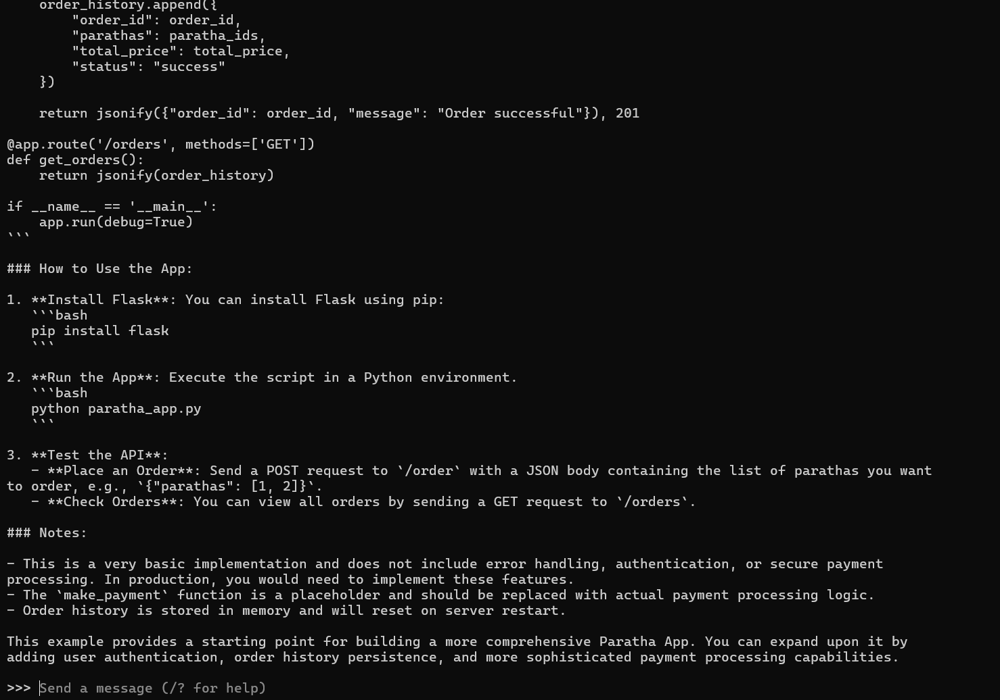

'''# Coding Agent 🤖

A fine-tuned coding agent built with Qwen2.5-Coder-3B that generates step-by-step plans and complete working code for any app or website you describe.

## What it does
Give it a simple instruction like "make a todo app" and it will:
1. Generate a step-by-step plan
2. Write complete working code files

## Model
- Base model: Qwen2.5-Coder-3B-Instruct
- Fine-tuned with: Unsloth + LoRA
- Hosted on: [HuggingFace](https://huggingface.co/anubhabanjan1/anubhab-coding-agent)
- Live demo: [HuggingFace Spaces](https://huggingface.co/spaces/anubhabanjan1/anubhab-coding-agent)

## Run locally with Ollama

### 1. Install Ollama
Download from [ollama.com](https://ollama.com)

### 2. Download the model
Download `qwen2.5-coder-3b-instruct.Q4_K_M.gguf` from HuggingFace

### 3. Create Modelfile
FROM ./qwen2.5-coder-3b-instruct.Q4_K_M.gguf
SYSTEM "You are an expert coding agent. When given a user request, respond with:

A step-by-step plan
Complete working code files
Always output production-ready code."


### 4. Run
```bash
ollama create coding-agent -f Modelfile
ollama run coding-agent
```

### 5. Test


make a todo app
build a login page
create a REST API for a blog


## Tech Stack
- Python
- Unsloth
- HuggingFace Transformers
- PEFT / LoRA
- Gradio
- Ollama

## Files
- `app.py` — Gradio web app for HuggingFace Spaces
- `requirements.txt` — Python dependencies
- `agent_dataset.json` — Training dataset

## Training
- Dataset: 11 custom examples covering HTML, React, Python, Node.js
- Epochs: 3
- LoRA rank: 8
- Max sequence length: 1024

## Author
Anubhab Anjan Kumar Malik
- HuggingFace: [anubhabanjan1](https://huggingface.co/anubhabanjan1)
- GitHub: [Anubhab-anjan](https://github.com/Anubhab-anjan)
'''

## 🖼️ Project Demo

Below are screenshots of the **Coding Agent Gradio interface**, showing how a user
enters an instruction and receives a **step-by-step plan** along with
**complete production-ready code**.



